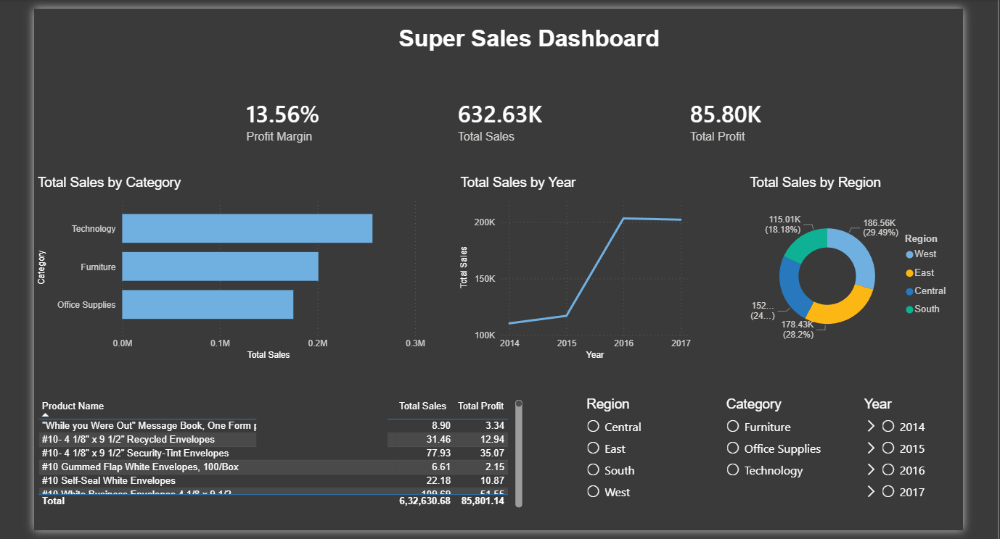

# Superstore Sales Dashboard

## Overview
This project is an interactive sales dashboard built in Power BI 
using the Sample Superstore dataset. The dashboard provides a 
comprehensive view of sales performance, profitability, and 
regional trends to support data-driven business decisions.

## Dashboard Preview

## Objectives
- Analyze total sales and profit across regions and categories
- Track sales trends over time (2014–2017)
- Identify top performing products by profit
- Enable dynamic filtering for deeper insights

## Key Insights
- Total revenue of $632K with a profit margin of 13.56%
- Technology is the highest selling category at $0.3M
- West region accounts for 29.49% of total sales
- Significant sales growth observed between 2015 and 2016

## Features
- KPI cards for Total Sales, Total Profit and Profit Margin
- Bar chart showing Sales by Category
- Line chart showing Sales trends over time
- Donut chart showing Sales distribution by Region
- Product table with Sales and Profit breakdown
- Interactive slicers for Region, Category and Year

## Tools Used
| Tool | Purpose |
|------|---------|
| Power BI Desktop | Dashboard development |
| Power Query | Data cleaning and transformation |
| DAX | Custom measures and calculations |

## Dataset
Sample Superstore dataset — available on Kaggle  
9,994 rows covering orders from 2014 to 2017

## How to Use
1. Download the `.pbix` file
2. Open in Power BI Desktop (free)
3. Use the slicers to filter by Region, Category or Year
